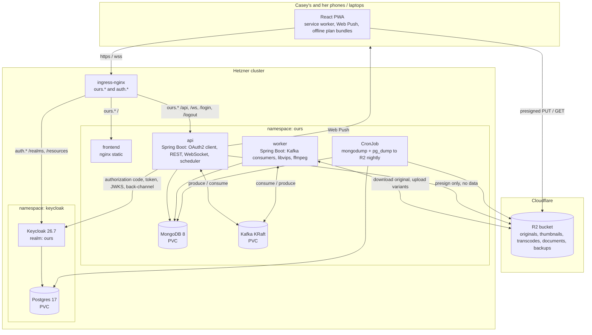
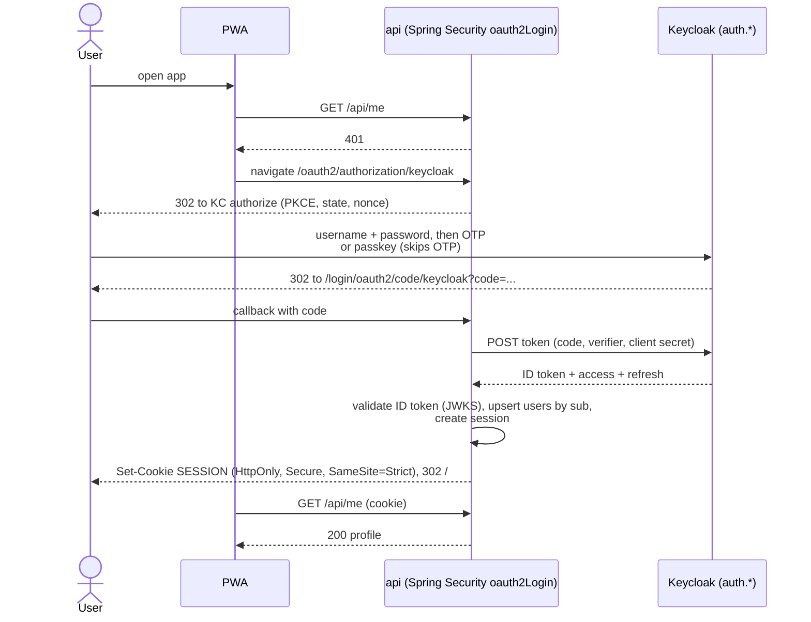
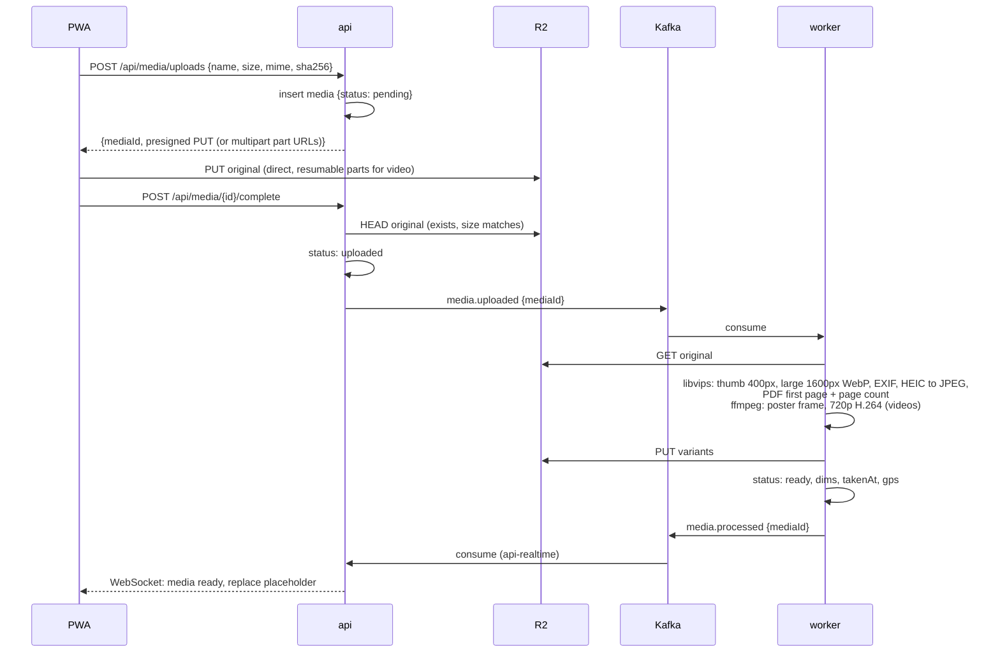

# Architecture plan

A private, two-user app: memory journal with photos and videos, trip and event planning, one live chat, notes, and a shared calendar. Runs on the existing Hetzner cluster next to GrindTrack and the personal website, with Keycloak as the identity provider. Working name "Ours". Domain `caseylovesyas.com`, registered through Vercel and used only for DNS: `ours.caseylovesyas.com` for the app and `auth.caseylovesyas.com` for Keycloak. Both hostnames are configuration, never code: two Ingress hosts, one Keycloak `KC_HOSTNAME`, one Spring `issuer-uri`, the realm's redirect URIs through an environment placeholder, and the R2 CORS origin. Moving to another domain later is re-pointing DNS and changing those values, not a rebuild.

This document is the plan, not the build. Each milestone at the bottom turns one section into code.

Versions this plan targets, verified 2026-09-06:

| Component | Version | Notes |
|---|---|---|
| Java | 25 (LTS) | Runtime and compile target |
| Spring Boot | 4.1.1 | Spring Framework 7.0, Spring Security 7.1, Spring Data 2026.0, Spring Kafka 4.1, MongoDB driver 5.8 |
| Keycloak | 26.7 | Passkeys fully supported since 26.4; recovery codes enforced after OTP setup since 26.4 |
| MongoDB | 8 | Single-node replica set |
| Apache Kafka | 3.9 | KRaft mode, single node |
| React | 19 | TypeScript strict, Vite |

## 1. Decisions

Same format as the cluster's decision log. Newest at the bottom.

| # | Decision | Alternatives | Rationale |
|---|---|---|---|
| 1 | **Mobile-first PWA, not a native app** | React Native, Flutter | One codebase, one deploy pipeline you already run. Web Push now works on iOS (16.4+, installed to home screen). Native is the upgrade path if the PWA ever feels limiting. |
| 2 | **Spring Boot 4.1 on Java 25, React 19 + TypeScript** | Spring Boot 3.5 / Java 21 like GrindTrack | Matches your day job, so every hour here is practice for work. Boot 4 is the biggest Spring change since Jakarta: new starter names, Jackson 3, Spring Security 7 with no implicit behavior. Section 6 lists what that means in practice. GrindTrack gets the same upgrade later. |
| 3 | **MongoDB 8 as the application database** | Postgres + JSONB | You asked for NoSQL, and the data is document-shaped: a memory post is one document with nested media, perspectives, reactions, and comments. Plans, chat messages, and calendar events are natural documents too. Run as a single-node replica set so transactions and change streams are available. |
| 4 | **Apache Kafka (KRaft, single node) as the event backbone** | Spring `@Async` + a Mongo work queue, RabbitMQ, Redpanda, NATS | Kafka is a stated learning goal. Two users never need it, but media processing and notifications are genuinely asynchronous, so the events are real, not invented. It is fenced behind Spring Kafka so it can be swapped if it ever becomes a burden. Redpanda is the fallback if memory gets tight. |
| 5 | **Cloudflare R2 for all photos, videos, and documents** | Backblaze B2, Hetzner Object Storage, Hetzner Volume, node disk | S3-compatible, 10 GB free then about $0.015 per GB-month, and zero egress fees, which matters for streaming video to two phones repeatedly. B2 is cheaper per GB but charges egress past 3x storage. Hetzner Object Storage has a fixed monthly minimum that costs more at this scale. Node disk is node-bound and unbacked. Both R2 and B2 speak S3, so switching is a config change. |
| 6 | **Uploads go browser to R2 directly with presigned URLs** | Upload through the API | Keeps multi-gigabyte videos off the worker node's ingress and JVM. The API only issues signatures and records metadata. |
| 7 | **Keycloak is the identity provider** | Port GrindTrack's custom auth, Google sign-in, Auth0, Zitadel, Authentik | Apache 2.0 licensed, CNCF incubating since 2023, and the self-hosted identity provider you are most likely to meet at work. It gives password policy, brute-force protection, TOTP, recovery codes, passkeys, session management, an account console, and audit events out of the box, all of which the previous plan had you writing by hand. The cost is one more JVM and one more Postgres on the cluster. It is deployed as a platform service in its own namespace so GrindTrack can move onto it later with its own realm. |
| 8 | **The Spring API is the OAuth2 client (backend-for-frontend), not the SPA** | SPA as public client with PKCE and tokens in browser memory | Tokens never reach the browser. The SPA gets one `HttpOnly Secure SameSite=Strict` session cookie from the API, which is the same CSRF posture GrindTrack has. This is also what the IETF's browser-based apps guidance recommends. Spring Security's `oauth2Login` does the whole dance with configuration, not code. |
| 9 | **Keycloak pages themed with Keycloakify** | Keycloak's FreeMarker themes, leave the default theme | The login page, OTP setup, recovery codes, and account console are Keycloak pages, and they have to look like the app. Keycloakify builds Keycloak themes from a React and TypeScript project, so the design mockups apply to them directly. |
| 10 | **Two backend deployables from one Maven build: `api` and `worker`** | One process doing everything | Image processing and ffmpeg spike CPU and memory. Keeping them in a separate pod with their own limits means a 4K video transcode can never make chat lag. Shared `common` module holds the domain and event contracts. |
| 11 | **Frontend served by its own nginx container, path-routed on one host** | Bake the SPA into the Spring jar like GrindTrack | Service-worker and cache headers are easier in nginx, and the frontend deploys independently of the backend images. One host keeps cookies same-origin. |
| 12 | **App and Keycloak on subdomains of the same registrable domain** | Keycloak on an unrelated domain | `SameSite=Strict` cookies survive the redirect back from Keycloak only when both hosts are the same site, meaning the same registrable domain. `ours.caseylovesyas.com` and `auth.caseylovesyas.com` qualify. Any future domain must keep the same shape: two subdomains of one registrable domain. |
| 13 | **Manifests live in `k8s-cluster-hetzner/kubernetes/apps/`** | Manifests in the app repo | Matches the existing convention. The app repo's CI builds images and runs `kubectl set image` through namespaced `ci-deployer` accounts. |
| 14 | **No Redis** | Redis for rate limiter, presence, sessions | One API replica, so in-memory is correct. Add Redis only if a second replica ever appears. |
| 15 | **Web Push only for notifications at first** | Email, SMS | Free, private, and it reaches phones. Email can come later for calendar reminders if push proves unreliable. |
| 16 | **Plans are their own module, not a memory type and not a calendar event** | A "trip" memory with extra fields; a folder of calendar events | A plan is a living workspace for months before the trip and a logistics record during it. A memory is what you write afterward. They are linked, not merged: a finished plan hands off to a new memory. |
| 17 | **One `plan_items` collection with a `kind` discriminator** | A collection per kind (flights, stays, ideas...) | A restaurant found on Instagram starts as an idea, gets shortlisted, lands on a day, gets a reservation confirmation attached, and shows up on the calendar. That is one document changing status, not four records to keep in sync. Every view in the plan is a lens over the same collection. Kind-specific fields are a Java sealed interface, so Java 25 pattern matching handles the variants. |
| 18 | **The calendar derives from plans, it does not copy them** | Sync plan items into the `events` collection | A calendar query merges its own events with plan date ranges and booked items at read time. Nothing can drift. |
| 19 | **Plans are readable offline** | Online only | Trips are exactly where connectivity is worst. The service worker caches a per-plan bundle and its documents on request, read-only at first. Confirmation codes and addresses on a train platform in Kyoto is the use case. |
| 20 | **Two outside services, both being built** | Do everything in-cluster | Map tiles from OpenStreetMap load only when the Map view is opened, and only tile images. "Paste a confirmation" parsing uses the Claude API and is opt-in per paste, because that text leaves your cluster; you decided the convenience is worth it for this one feature and want the hands-on time with the API. Everything else works without either. |
| 21 | **The first plan is seeded, not typed** | Start with an empty Plans tab | Japan, 4 to 19 February 2027, Tokyo, Hakuba, and Kyoto, home currency USD, local currency JPY. A seed script creates the plan, its destinations, and the default checklists at the end of milestone 2. The flights and lodging are already booked through Expedia, so the real confirmations get entered by hand in milestone 2 and become the first real test of the confirmation parser in milestone 6. |
| 22 | **Flamingock for MongoDB schema changes, from day one** | Mongock, hand-run scripts, Spring Data index annotations only | Every index, collection, and data migration is a versioned change class in the `common` module with an audited history in Mongo and a distributed lock, so the api and the worker can start at the same time safely. Mongock is in maintenance mode and reaches end of life at the end of 2026; Flamingock is its successor by the same team with the same change-unit idea. Spring Data's `auto-index-creation` stays off so Flamingock is the only thing that touches the schema. |
| 23 | **The frontend is built from the Claude Design canvases, screens first, data second** | Build each screen only when its milestone's api exists | The design project produced every screen with realistic content, so the whole UI is implemented against a typed mock store in `src/data` that mirrors the canvases' data, and each later milestone swaps the hooks in `src/data/hooks.ts` to the api without touching screens. You and she get the real app to walk through after milestone 1, and the api work in milestones 2 to 6 lands into finished screens. The design sources live in `design/` in the repo, verbatim, as the reference. |
| 24 | **Fonts and icons are self-hosted packages** | Google Fonts links as in the canvases | The canvases load Newsreader, Inter Tight, and JetBrains Mono from Google Fonts. The app bundles them through `@fontsource` packages and draws icons with `lucide-react`, so the CSP stays at `font-src 'self'` and no request leaves for a third party. |

## 2. System overview



Request paths:

| Host and path | Backend | Notes |
|---|---|---|
| `ours.* /` | frontend | SPA with fallback to `index.html`; hashed assets cached immutable; `index.html` and `sw.js` never cached |
| `ours.* /api/**` | api | JSON REST, session cookie required |
| `ours.* /ws` | api | WebSocket upgrade; ingress needs long read/send timeouts |
| `ours.* /oauth2/**`, `/login/**`, `/logout/**` | api | Spring Security's OAuth2 login, callback, and logout endpoints |
| `auth.* /realms/**`, `/resources/**` | keycloak | Login pages, OIDC endpoints, account console, theme assets |
| `auth.* /admin/**` | not routed | Admin console reached only through `kubectl port-forward` |

## 3. Components

### frontend
React 19, TypeScript strict, Vite. Five tabs on mobile: Memories, Plans, Calendar, Chat, Us. Notes live inside the Chat tab as a second segment. Libraries chosen to avoid writing hard things yourself:

| Concern | Choice |
|---|---|
| Routing | React Router |
| Server state and caching | TanStack Query |
| Client state (chat, socket, presence) | Zustand |
| Rich text for memory bodies | Tiptap; body stored as ProseMirror JSON, rendered read-only by Tiptap too |
| Styling | Tailwind CSS v4; the design tokens from the system sheet (paper, ink, terracotta accent, sage, plum, ochre, the note palette) are CSS custom properties mapped into Tailwind's `@theme` |
| Typefaces and icons | `@fontsource` packages for Newsreader, Inter Tight, and JetBrains Mono; `lucide-react` for the nine item-kind icons and the rest |
| Mock data during the build-out | `src/data` holds typed mock datasets transcribed from the canvases, a `mockImage` helper that draws placeholder photos as data URIs so no image request leaves the app, and hooks that later milestones point at the api |
| PWA | `vite-plugin-pwa` (Workbox), custom service worker for push events and offline plan bundles |
| Photo grid and lightbox | `react-photo-album` + `yet-another-react-lightbox` |
| Drag and drop (itinerary, checklists, media reorder) | `@dnd-kit/core` |
| Map view for plans | Leaflet with OpenStreetMap tiles, loaded only on the Map view |
| WebSocket | `@stomp/stompjs` |
| Dates and recurrence | `date-fns` and `date-fns-tz`, `rrule` for recurrence preview, `chrono-node` for the natural-language quick-add |

There is no auth library in the SPA. It calls `GET /api/me`; a 401 means "navigate to `/oauth2/authorization/keycloak`", and the browser comes back signed in. Sign out is a form POST to `/logout`. Every state-changing request carries the CSRF token that Spring exposes in a readable cookie.

### api
Spring Boot 4.1 on Java 25. Modules of responsibility inside one process:

- **auth**: `oauth2Login` against the Keycloak realm, session cookie, CSRF, OIDC back-channel logout, and a `users` upsert from ID-token claims on first sign-in. No password, OTP, or token code lives here.
- **memories, media, plans, chat, notes, calendar**: REST controllers and services, each its own package.
- **links**: one SSRF-guarded fetcher for link previews, used by ideas and by chat. Spring Boot 4.1's `InetAddressFilter` blocks private and loopback ranges.
- **realtime**: STOMP over WebSocket with the simple broker. The handshake is authenticated by the same session cookie and checks `Origin`.
- **events**: Kafka producers; one consumer group `api-realtime` that turns `chat.message.created`, `plan.item.changed`, and `media.processed` into WebSocket pushes.
- **scheduler**: `@Scheduled` every minute, finds due reminders and scheduled notes, publishes `notification.requested`.
- **push**: Web Push sender with VAPID keys from a Kubernetes secret. Consumer group `notifier`.

### worker
Same Maven build, different Spring Boot main. Consumer group `media-worker`. The image is Debian-based Temurin 25 JRE plus `libvips-tools` and `ffmpeg`, invoked with `ProcessBuilder` on virtual threads. libvips handles HEIC from iPhones, auto-rotation, EXIF read, fast resizing at low memory, and first-page thumbnails of PDFs through its poppler support. ffmpeg makes poster frames and a 720p H.264 rendition so HEVC iPhone videos play in every browser.

### Keycloak
Section 5 covers the design. Operationally: official `quay.io/keycloak/keycloak:26.7` as the base of a small custom image that adds the Keycloakify theme JAR and, later, the event-listener extension, runs `kc.sh build --db=postgres`, and starts with `start --optimized`. Its own Postgres 17 with a 2 Gi PVC. Health and metrics on the management port 9000, never exposed.

### MongoDB
`mongo:8`, one replica, started with `--replSet rs0` and initiated once. WiredTiger cache capped at 0.25 GB so the pod's memory limit is meaningful. Auth enabled; reachable only inside the namespace. PVC 10 Gi on `local-path`. MongoDB 5+ requires AVX on x86; CX33 CPUs have it, but verify once on the worker:

```bash
grep -c avx /proc/cpuinfo
```

### Kafka
`apache/kafka:3.9` in KRaft mode, one node acting as broker and controller, heap capped at 512 MB, PVC 5 Gi, topic retention 7 days. No SASL at first; NetworkPolicy is the fence. Strimzi is the later learning upgrade if you want operators.

## 4. Data model (MongoDB collections)

Two users, so nothing here needs sharding thought. Credentials, OTP secrets, passkeys, recovery codes, sessions with Keycloak, and login history all live in Keycloak's Postgres, not here.

| Collection | Key fields | Indexes |
|---|---|---|
| `users` | `keycloakId` (the `sub` claim), `username`, `displayName`, `avatarMediaId`, `prefs { theme, timezone, homeCurrency }`, `createdAt` | `keycloakId` unique |
| `memories` | `title`, `type` (trip, date, everyday, milestone), `dateStart`, `dateEnd`, `location { name, lat, lng }`, `tags[]`, `coverMediaId`, `mediaIds[]`, `perspectives[] { authorId, body (ProseMirror JSON), updatedAt }`, `reactions[]`, `comments[]`, `status` (draft, published), `visibility` (author-only, shared), `linkedPlanId?`, `createdBy`, timestamps | `dateStart desc`; `type`; text index on `title` |
| `media` | `ownerId`, `memoryId?`, `kind` (photo, video, document), `mime`, `size`, `keys { original, thumb, large, poster, mp4 }`, `width`, `height`, `duration`, `pageCount`, `takenAt`, `gps`, `caption`, `favorite`, `status` (pending, uploaded, processing, ready, failed), `deletedAt?` | `memoryId`; `takenAt desc`; `status` |
| `albums` | `name`, `mediaIds[]`, `coverMediaId`, `createdBy` | |
| `plans` | `name`, `type` (trip, event), `status` (dreaming, planning, booked, underway, done), `dateStart`, `dateEnd`, `timezone`, `destinations[] { name, countryCode, lat, lng }`, `coverMediaId`, `currency { home, local, rate, rateSetAt }`, `budgetPlanned`, `lockedNoteEnc?`, `notifyOn { votes, comments, decided, booked }`, `linkedMemoryId?`, `createdBy`, timestamps, `archivedAt?` | `status, dateStart` |
| `plan_items` | `planId`, `kind` (flight, stay, transport, activity, food, ticket, idea, note), `title`, `status` (idea, shortlisted, decided, booked, done, cancelled), `day?`, `start?`, `end?`, `timezone`, `location { name, address, lat, lng, mapsUrl }`, `details` (kind-specific, see below), `cost { amount, currency, paid }`, `confirmation?`, `links[] { url, title, image, site }`, `attachmentIds[]`, `tags[]`, `votes { userId: like, meh, no }`, `comments[]`, `sortKey`, `createdBy`, `updatedBy`, timestamps | `planId, day, sortKey`; `planId, status`; `planId, start` |
| `plan_checklists` | `planId`, `name`, `kind` (todo, packing, shopping, guests), `items[] { id, text, done, assignee, dueDate?, doneBy?, doneAt? }`, `sortKey` | `planId` |
| `messages` | `senderId`, `kind` (text, media, voice, link, memory, plan_item), `text`, `mediaIds[]`, `memoryId?`, `planItemId?`, `replyToId?`, `reactions[]`, `pinned`, `editedAt?`, `deletedAt?`, `readAt?`, `createdAt` | `createdAt desc`; text index on `text` |
| `notes` | `authorId`, `recipientId`, `body`, `color`, `mediaId?`, `sealed`, `scheduledFor?`, `deliveredAt?`, `openedAt?` | `recipientId, scheduledFor` |
| `events` | `title`, `ownerId` (user id or `both`), `type`, `start`, `end`, `allDay`, `timezone`, `rrule?`, `exdates[]`, `overrides[]`, `reminders[] { leadMinutes }`, `location`, `notes`, `linkedMemoryId?` | `start` |
| `reminder_schedule` | `source` (event, plan_item, checklist_item), `sourceId`, `occurrenceStart`, `fireAt`, `firedAt?` | `fireAt` |
| `push_subscriptions` | `userId`, `endpoint`, `keys`, `ua`, `createdAt` | `userId`; `endpoint` unique |
| `audit_log` | `userId`, `action`, `target`, `at`, `ip` | `at desc` |
| `sessions` | managed by Spring Session MongoDB, optional | TTL index on expiry |

`plan_items.details` by kind, as a sealed interface in `common`:

| Kind | Details record |
|---|---|
| `flight` | `airline`, `flightNumber`, `fromAirport`, `toAirport`, `depart`, `arrive`, `seats`, `pnr` |
| `stay` | `checkIn`, `checkOut`, `phone`, `roomInfo` |
| `transport` | `mode` (train, car, bus, ferry, transfer), `from`, `to`, `depart`, `arrive`, `passInfo` |
| `activity` | `durationMinutes`, `bookingRequired`, `openingHours` |
| `food` | `cuisine`, `reservationAt`, `partySize` |
| `ticket` | `validFrom`, `validTo`, `quantity` |
| `idea`, `note` | none; an idea is anything not yet committed to a kind, and a note is free text on a day |

Schema management: Flamingock, decision 22. Change classes live in `common` under one package, numbered and dated, and run at startup of both the api and the worker under Flamingock's distributed lock. The first change creates the `users` collection with its unique index. Spring Data's `auto-index-creation` is off, and every index in the table above is created by a change class, so the audit collection in Mongo is the complete history of the schema.

## 5. Authentication with Keycloak

### What Keycloak does, and what the app never has to

| Concern | Where it lives | Notes |
|---|---|---|
| Passwords, hashing, password policy | Keycloak | Argon2 is Keycloak's default hashing since 24. Policy: minimum length 14, not username, no reuse of last 5. |
| Brute-force protection | Keycloak | Realm setting: 5 failures, then a 15-minute wait, escalating; permanent lockout off so neither of you locks the other out. |
| TOTP | Keycloak | `Configure OTP` is a required action on both accounts, so the first sign-in cannot be completed without enrolling an authenticator. |
| Recovery codes | Keycloak | Since 26.4 the realm can enforce recovery-code setup right after OTP setup. Turn that on. Replaces the hand-written backup codes. |
| Passkeys | Keycloak | Fully supported since 26.4. The 26.4+ default browser flow shows a passkey button on the username page, and a `Conditional credential` step skips OTP when a passkey was the primary credential. WebAuthn Passwordless policy: discoverable credential `preferred`, user verification `required`. |
| Sessions and devices | Keycloak | SSO session idle 14 days, max 30 days. `Remember me` enabled with idle 30 days, max 90 days. The account console lists devices and signs any of them out. |
| Login and admin events | Keycloak | Enable both, keep 30 days. Section 11 turns login events into push alerts. |
| Who you are in the app | api, `users` collection | Keyed by the `sub` claim. Display name, avatar, timezone, theme, home currency. |

**Trusted device is the one thing Keycloak lacks.** "Skip OTP on this device for 30 days" is a long-open feature request (keycloak/keycloak#8742) and only exists as community extensions. Two things make it unnecessary here: `Remember me` keeps the Keycloak session alive across browser restarts for 30 days of inactivity, so a full password + OTP login happens roughly monthly, and a passkey login is one biometric tap with no OTP step at all. The design prompt says "Remember me" instead of "Trust this device".

### Realm `ours`

Configured once in `keycloak/realm/ours-realm.json` in the repo and imported on first boot with `--import-realm`. Keycloak substitutes `${VAR}` placeholders in the file from environment variables at import time, so the client secret, both usernames, both temporary passwords, and the app URL are placeholders filled from a Kubernetes secret; nothing sensitive and no hostname is in the file. Keycloak imports only when the realm does not already exist, so later changes are made in the admin console and re-exported into the file with the placeholders put back.

- User registration off. No identity providers. No email verification flow, since there is no self-service.
- Two users, created by the realm import with temporary passwords and required actions `Update Password` and `Configure OTP`. Neither of you sees the other's credentials.
- Client `ours-web`: confidential, standard flow only, PKCE `S256` required, redirect URI `https://ours.caseylovesyas.com/login/oauth2/code/keycloak`, post-logout redirect `https://ours.caseylovesyas.com/`, back-channel logout URL `https://ours.caseylovesyas.com/logout/connect/back-channel/keycloak`. The client secret is generated after import and stored only in the Kubernetes secret.
- Browser flow: the 26.4+ default, which already includes the passkey conditional UI and the OTP skip when a passkey was used. Do not build a custom flow until the default has failed you.
- Admin: `KC_BOOTSTRAP_ADMIN_USERNAME` and `KC_BOOTSTRAP_ADMIN_PASSWORD` on first start only. Sign in, create a permanent admin with OTP in the `master` realm, delete the temporary one, remove the two variables from the manifest.

### Sign-in sequence



Signing out is `POST /logout`. Spring's `OidcClientInitiatedLogoutSuccessHandler` ends the Keycloak session too, and Keycloak's back-channel logout ends the Spring session if a device is signed out from the account console.

### Spring Security 7 wiring

Configuration, not code. The provider is discovered from `spring.security.oauth2.client.provider.keycloak.issuer-uri: https://auth.caseylovesyas.com/realms/ours`. Session cookie: `server.servlet.session.cookie.same-site: strict`, `http-only` and `secure` true. CSRF on with `CookieCsrfTokenRepository` and the SPA request-attribute handler, so the SPA reads `XSRF-TOKEN` and echoes it as a header. `oidcLogout` with back-channel enabled. Everything under `/api/**` and `/ws` requires authentication; `/actuator/health` and the OAuth2 endpoints are open. No `permitAll` anywhere else.

In-cluster calls from the api to Keycloak should stay on the private network. Set `hostname-backchannel-dynamic=true` on Keycloak and point Spring's `token-uri`, `jwk-set-uri`, and `user-info-uri` at the in-cluster service while `issuer-uri` stays the public hostname. Verify the issuer claim matches during milestone 1; the fallback is letting the api reach the public hostname, which hairpins through ingress and also works.

Session storage: the servlet session in memory is fine for one replica. A pod restart signs both of you out of the api, but the Keycloak SSO session is still alive, so the next request bounces through Keycloak and back without a prompt. If that blip ever annoys, `spring-session-data-mongodb` keeps sessions in Mongo across restarts.

### Themes with Keycloakify

`keycloak/theme/` is a Keycloakify project: React and TypeScript, the same Tailwind tokens as the app, building a theme JAR that the Keycloak image copies into `providers/`. Pages to theme, all of which the design prompt covers: login, OTP entry, OTP setup with QR and manual key, recovery codes, passkey registration, update password, error, and the account console's security pages. Keycloakify supports Keycloak 11 through 26 and is actively maintained.

### Account and security settings

The app's "Us" tab links to Keycloak's account console for password, authenticator, passkeys, recovery codes, devices, and sign-in activity. That page is themed so it feels like the app. The app itself keeps only profile and preferences. This removes an entire settings backend from the build.

## 6. Spring Boot 4 and Java 25 notes

What changes compared with GrindTrack's Boot 3.5 / Java 21 code, so nothing surprises you in milestone 1.

**Starters have new names.** Old ones still resolve but are deprecated. Use the new ones from day one:

| Purpose | Starter |
|---|---|
| Web MVC | `spring-boot-starter-webmvc` |
| Security | `spring-boot-starter-security` |
| OAuth2 login | `spring-boot-starter-security-oauth2-client` |
| MongoDB | `spring-boot-starter-data-mongodb` |
| WebSocket | `spring-boot-starter-websocket` |
| Validation | `spring-boot-starter-validation` |
| Actuator | `spring-boot-starter-actuator` |
| Kafka | `spring-kafka` (Spring Kafka 4.1) |
| Tests | `spring-boot-starter-test`, `spring-boot-starter-webmvc-test`, `spring-boot-starter-security-test`, `spring-boot-testcontainers` |

**Jackson 3.** Group id and packages moved from `com.fasterxml.jackson` to `tools.jackson`. Records serialize with no annotations, which is all the Kafka event contracts need. Customize through `JsonMapperBuilderCustomizer`, and the property prefix is `spring.jackson.json.read.*` and `spring.jackson.json.write.*`.

**MongoDB properties** moved from `spring.data.mongodb.*` to `spring.mongodb.*`, so the connection string is `spring.mongodb.uri`.

**Spring Security 7** has no implicit behavior: every rule is declared. `@MockBean` is gone; tests use `@MockitoBean`. `@SpringBootTest` no longer wires MockMvc by itself; add `@AutoConfigureMockMvc`.

**Java 25 features worth using here, none of them preview:**

- Virtual threads for the whole app: `spring.threads.virtual.enabled: true`. The worker's blocking `ProcessBuilder` calls and the API's WebSocket sessions are exactly the workloads they are for.
- Records and sealed interfaces for every Kafka event, every API response, and the `plan_items.details` variants, with pattern matching in `switch` on the consumer side.
- Compact object headers (`-XX:+UseCompactObjectHeaders`), a production feature in 25, which trims heap use noticeably in small pods.
- The JDK AOT cache for faster startup, once the image is stable. Optional, and a nice one to benchmark.
- Scoped values, final in 25, for request-scoped context in virtual-thread code instead of `ThreadLocal`.

Toolchain: `maven:3.9-eclipse-temurin-25` build stage, `eclipse-temurin:25-jre` runtime, `setup-java` with `25` in CI.

## 7. Plans: trips and events

This is the feature she asked for, and the one most likely to be open every day for the months before Japan. The organizing idea is simple: **one plan per trip or event, and inside it everything is either an item or a checklist.** Every view is a different lens over the same items, so nothing is filed twice.

### How a plan is organized

| View | What it shows | It is really |
|---|---|---|
| Overview | Countdown, next booked thing, key bookings, budget snapshot, checklist progress, newest ideas | A dashboard over everything below |
| Itinerary | Day by day, time-sorted, with an "unscheduled" tray | Items with a `day` |
| Ideas | The wishlist board with both partners' votes, filterable by city and tag | Items with status `idea` or `shortlisted` |
| Bookings | Flights, stays, transport, tickets, reservations, each with confirmation and documents | Items with status `booked` |
| Checklists | Before we go, packing (one each), shopping, and guests for events | `plan_checklists` |
| Budget | Planned, committed, and paid, in home and local currency | Items summed by kind and status |
| Documents | Every PDF and image attached anywhere in the plan | `media` with `kind: document` reachable from this plan |
| Map | Pins for every item with coordinates, colored by kind | Items with `location.lat` |
| Today | During the trip: today's timeline, the next item highlighted, copyable confirmations, "open in Maps" | Itinerary filtered to the current local date |

The lifecycle: `dreaming` (a name and a maybe-date), `planning` (ideas and votes), `booked` (flights and stays exist), `underway` (between the dates; the plan opens on Today), `done` (after the end date; a banner offers to turn it into a memory). Status is set by hand, with `underway` and `done` suggested automatically from the dates.

### An item's life

A restaurant she found on Instagram:

1. **Idea.** She pastes the link into the plan. The api fetches the page's title and image through the SSRF-guarded link fetcher, and an `idea` item appears on the Ideas board tagged "Kyoto".
2. **Shortlisted.** You tap "like", she has already liked it. Both votes show on the card. Either of you marks it `shortlisted`.
3. **Decided.** You drag it onto Day 4 in the itinerary. The item gets `day`, and its kind changes to `food`. Nothing else is created.
4. **Booked.** She makes the reservation, types the time and the confirmation into the item, attaches a screenshot. Status `booked`. It now appears in Bookings, on the shared calendar at that time, in Today mode on Day 4, and a reminder fires two hours before.
5. **Done.** After the trip, the memory you write links back to this plan, and the photos taken that evening are suggested by their timestamps.

Items are created from three places: the plan itself, the chat ("Save to plan" on any message with a link or a photo), and the global "+" button, which asks which plan.

### Trips versus events

Same collections, different defaults. A `trip` plan opens the full set of views and item kinds. An `event` plan, such as an anniversary weekend or hosting friends for a holiday, has a single-day schedule instead of a multi-day itinerary, hides flights and stays from the kind picker, and adds a `guests` checklist kind. Everything else is identical.

### Budget

Each item has an optional cost in a currency. The plan holds a home currency, a local currency, and a manually entered exchange rate, because a live FX API is another outside service and a rate typed once is accurate enough for a holiday. Budget totals three numbers per kind: planned (every item with a cost), committed (status `booked`), paid (`cost.paid` true), shown in both currencies.

### Documents

PDFs and images attach to items or to the plan. They ride the media pipeline unchanged: presigned upload to R2, and the worker renders a first-page thumbnail with libvips and records the page count. Size limit 25 MB per document.

### The locked note

Each plan has one optional locked note for things like passport numbers and emergency contacts. It is encrypted at rest with AES-256-GCM under an app key held in a Kubernetes secret, separate from everything else, is never included in the offline bundle or an export unless explicitly requested, and is blurred in the UI until tapped. Keep this small; it is not a password manager.

### Offline and Today mode

A per-plan "Available offline" toggle makes the SPA fetch `GET /api/plans/{id}/bundle`, one JSON document with the plan, its items, its checklists, and presigned URLs for its documents, then store the JSON and the document bytes in Cache Storage through the service worker. Offline, the plan renders from that copy with a "saved 2 hours ago" banner, and Today mode works fully. Editing offline is read-only in the first version; queued writes come later if you miss them. Presigned URLs expire after 15 minutes, which does not matter once the bytes are cached.

During the trip, the plan opens on Today: the destination's local date and time, today's items in order with the next one highlighted, confirmation codes as large copyable text, addresses as "open in Maps" links using the platform's URL scheme, and a one-tap jump to tomorrow.

### Calendar and reminders

The calendar never stores plan data. A window query merges the `events` collection with every plan whose dates overlap the window, shown as a spanning all-day bar, and every `booked` item with a `start` inside the window, shown as a timed event colored by plan. Booked items get default reminders written to `reminder_schedule` with `source: plan_item`: 24 hours and 3 hours before a flight, 9:00 local on a check-in day, 2 hours before a reservation or ticket. Checklist items with a due date get one reminder at 9:00 that day. All of it is editable per item.

### Hand-off to Memories

After the end date, the plan shows "Turn this trip into a memory". It creates a draft memory of type `trip` with the plan's dates, destinations, and cover, a body pre-filled with one heading per itinerary day and the day's items as a starting list, and a media picker pre-filtered to photos whose `takenAt` falls inside the dates. The plan's status becomes `done`, `linkedMemoryId` is set, and the plan stays as the record of the logistics.

### Export

- **Print view**: `GET /api/plans/{id}/print` renders a clean, paginated itinerary as HTML with the app's print stylesheet, so either phone can save it as a PDF.
- **Calendar file**: `GET /api/plans/{id}/ics` downloads the booked items as an `.ics` file for import into her phone's calendar. It is a download, not a subscription URL, so no unauthenticated endpoint exists.

### Paste a confirmation (opt-in)

Airlines and hotels send confirmation emails that are tedious to retype. A "Paste confirmation" sheet takes pasted text or a screenshot, sends it to the Claude API, and returns a pre-filled booking form that you review and save. Nothing is saved without your tap. The trade-off is honest: that email text leaves your cluster for the duration of the request. It is off by default, enabled once in settings, and confirmed on every paste. The manual forms are always there and are what milestone 2 ships; the parser lands in milestone 6.

Implementation notes for when you get there:

- Java SDK `com.anthropic:anthropic-java`, model `claude-opus-5`, called from the api on a virtual thread with streaming so a slow response never ties up a request thread.
- Structured outputs with a JSON schema generated from the sealed `details` records, so the reply is guaranteed to parse into a `plan_items` document with the right kind. One schema, a `kind` field, and the kind-specific fields as optional groups.
- Screenshots go in as image content blocks; pasted email text goes in as text. The prompt asks for exactly one booking per paste and for `null` on anything not present, never a guess.
- Enable the server-side refusal fallback the SDK offers so a classifier decline degrades to another model instead of an error.
- The API key lives in a Kubernetes secret and is the only credential in the api that reaches outside the cluster. Log the token usage per paste to `audit_log` so the cost stays visible.
- Never send the locked note, and never send documents automatically. Only what was pasted into the sheet.

### Realtime and notifications

Every write to a plan item publishes `plan.item.changed`. The `api-realtime` consumer pushes it to `/topic/plans/{planId}` so a plan open on both phones updates live, and a small "she's looking at this plan" presence dot comes for free. Notifications go only for votes, comments, `decided`, and `booked` on items the other person created, and each plan has a `notifyOn` setting so a burst of planning does not become a burst of pings. Stale writes to an item's text fields return 409 when `updatedAt` does not match; the client refreshes and retries.

### API surface

| Method and path | Purpose |
|---|---|
| `GET, POST /api/plans`; `GET, PATCH, DELETE /api/plans/{id}` | Plans, with status filter on the list |
| `GET, POST /api/plans/{id}/items`; `PATCH, DELETE /api/plans/{id}/items/{itemId}` | Items; `PATCH` covers status, day, kind, and details changes |
| `POST /api/plans/{id}/items/reorder` | Bulk `sortKey` and `day` update after a drag |
| `PUT /api/plans/{id}/items/{itemId}/vote` | This user's vote |
| `POST /api/plans/{id}/items/{itemId}/comments` | Comment thread on an item |
| `GET, POST /api/plans/{id}/checklists`; `PATCH /api/plans/{id}/checklists/{listId}` | Lists and their embedded items |
| `GET /api/plans/{id}/budget` | Totals by kind and status in both currencies |
| `GET, PUT /api/plans/{id}/locked-note` | Decrypts on read, encrypts on write, audit-logged |
| `GET /api/plans/{id}/bundle` | Offline bundle |
| `GET /api/plans/{id}/print`, `GET /api/plans/{id}/ics` | Exports |
| `POST /api/plans/{id}/to-memory` | Hand-off |
| `POST /api/links/preview` | SSRF-guarded title and image for a URL |
| `POST /api/plans/{id}/parse-confirmation` | Only when the opt-in is enabled |

## 8. Media pipeline



**Serving.** The bucket is private. Any API response that includes media also includes presigned GET URLs valid for 15 minutes for each variant. Presigning is a local HMAC, not a network call, so batching hundreds per response is free. Video plays straight from R2 with range requests. The client refetches when a URL expires.

**Multipart.** Files over 100 MB use S3 multipart with presigned part URLs so an interrupted phone upload resumes instead of restarting.

**Bucket setup.** One bucket, keys like `orig/{mediaId}.{ext}`, `thumb/{mediaId}.webp`, `mp4/{mediaId}.mp4`, `backup/mongo/{date}.gz`, `backup/keycloak/{date}.sql.gz`. CORS allows PUT and GET from the app origin only. Lifecycle rule expires `backup/` objects after 30 days and `trash/` after 30 days.

**Deletion.** Soft delete sets `deletedAt` and the object moves under `trash/`. A weekly worker job purges anything older than 30 days. Originals are never regenerated, so they are never touched by processing; variants are disposable.

**Phone settings worth changing.** iPhone Camera, Formats, "Most Compatible" avoids HEIC and HEVC entirely and makes the worker's job trivial. The pipeline handles both anyway.

## 9. Chat and realtime

- Sending is a REST `POST /api/messages`, not a socket frame. The API persists to `messages`, then publishes `chat.message.created`. The `api-realtime` consumer delivers it over STOMP to `/user/{id}/queue/chat`. If the recipient has no open socket (presence is an in-memory set of connected user ids), the API publishes `notification.requested` and the notifier sends a Web Push.
- Typing indicators and read receipts are ephemeral socket frames; they never touch Kafka or Mongo, except `readAt` which is written on receipt.
- Edit, unsend, reactions, pin, reply: REST writes, then the same event path so the other side updates live.
- "Save to memories" creates a memory in draft with the message's media attached. "Save to plan" creates an idea in the chosen plan from the message's link or photo. Plan items can be shared into the chat as cards that deep-link back.
- Notes live in the Chat tab as a second segment; they keep their own collection and their own scheduled and sealed states.
- Search: Mongo text index on `messages.text`.
- Ingress annotations for `/ws`: `proxy-read-timeout` and `proxy-send-timeout` at 3600. The client sends STOMP heartbeats every 25 s so idle proxies never drop it.

Why Kafka in the middle of a two-person chat: it makes delivery, push, and persistence three independent consumers that can fail and retry separately, which is the pattern worth learning. Latency cost is single-digit milliseconds on one node.

## 10. Calendar, reminders, and notes

- Recurrence stored as an RFC 5545 `rrule` string plus `exdates` and per-occurrence `overrides`. Expanded server-side with `org.dmfs:lib-recur` for a requested window; the client previews with the `rrule` package.
- A window query returns three sources merged: expanded `events`, plan spans, and booked plan items, as section 7 describes. The client renders them with the plan's color and a small plan badge.
- On every event save, the API computes the next occurrence and writes one `reminder_schedule` row per reminder. Every minute the scheduler claims rows with `fireAt <= now` and `firedAt == null`, publishes `calendar.reminder.due`, marks them fired, and schedules the next occurrence. Plan items and due-dated checklist items feed the same table with their own `source`. Idempotent by design: a crash between publish and mark can at worst double-notify once.
- Reminder delivery is a Web Push through the notifier. Email is a later addition.
- Quick add parses on the client with `chrono-node`; the server receives structured fields.
- "Add a memory from this" pre-fills a composer with the event title, date, and location and stores `linkedMemoryId` back on the event.
- Timezone stored per event, defaulting from the user's profile. Plan items carry the destination's timezone.
- Notes have three states: immediate, scheduled (`scheduledFor` in the future, hidden until the same scheduler delivers it), and sealed (visible as an envelope until `openedAt` is set by the recipient). Delivery and opening both publish `notification.requested`.

## 11. Kafka topics and event contracts

| Topic | Key | Producer | Consumers | Payload |
|---|---|---|---|---|
| `media.uploaded` | mediaId | api | worker | `{ mediaId, ownerId, kind, key }` |
| `media.processed` | mediaId | worker | api-realtime | `{ mediaId, status, variants }` |
| `chat.message.created` | senderId | api | api-realtime | `{ messageId, senderId, recipientId, kind, createdAt }` |
| `plan.item.changed` | planId | api | api-realtime, notifier | `{ planId, itemId, change (created, updated, status, vote, comment), actorId, at }` |
| `notification.requested` | userId | api | notifier | `{ userId, title, body, url, tag }` |
| `calendar.reminder.due` | sourceId | api scheduler | notifier | `{ source, sourceId, occurrenceStart, userIds[] }` |
| `security.login` | userId | Keycloak event-listener extension | notifier, audit | `{ userId, ip, userAgent, outcome, at }` |

The last row is the Keycloak learning exercise with the most depth: an `EventListenerProviderFactory` packaged as a JAR in the Keycloak image that publishes `LOGIN`, `LOGIN_ERROR`, and `UPDATE_CREDENTIAL` events to Kafka. The notifier turns a login into a "New sign-in on Chrome, Windows" push on the user's other devices. It is milestone 7 work; until then Keycloak's own event log in the admin console is the record.

Conventions: JSON payloads as Java records in `common`, one record per topic, versioned by adding fields only. Consumers are idempotent (check `status` before acting). `DefaultErrorHandler` with exponential backoff, then `DeadLetterPublishingRecoverer` to `<topic>.dlt`. Start with write-then-publish; a transactional outbox in Mongo is a milestone 7 exercise once you have felt why it exists.

## 12. Deployment on the cluster

Two namespaces added to `kubernetes/cluster/namespaces/`: `keycloak` as a platform service, `ours` for the app. A `ci-deployer` binding for each, generated the same way as GrindTrack's.

Resource plan against the worker's current allocation of 1178 Mi requested and 2944 Mi in limits out of 7834 Mi allocatable:

| Workload | Namespace | CPU request | Memory request | Memory limit | Storage | Notes |
|---|---|---|---|---|---|---|
| keycloak | keycloak | 100m | 512 Mi | 1 Gi | none | `JAVA_OPTS_KC_HEAP=-Xms64m -Xmx400m`; Keycloak's sizing guide says 1250 Mi covers 10,000 cached sessions, so 1 Gi is generous for two |
| keycloak-postgres | keycloak | 50m | 128 Mi | 512 Mi | PVC 2 Gi | same manifest shape as the GrindTrack Postgres |
| frontend | ours | 25m | 32 Mi | 128 Mi | none | nginx, same as personal-website frontend |
| api | ours | 250m | 512 Mi | 1 Gi | none | `-Xmx512m`; readiness on `/actuator/health` |
| worker | ours | 250m | 512 Mi | 1 Gi | emptyDir scratch 5 Gi | ffmpeg pinned to 2 threads so it never starves the node |
| mongodb | ours | 100m | 256 Mi | 1 Gi | PVC 10 Gi | `--wiredTigerCacheSizeGB 0.25`, `strategy: Recreate` |
| kafka | ours | 100m | 512 Mi | 1 Gi | PVC 5 Gi | `KAFKA_HEAP_OPTS=-Xmx512m` |
| backup CronJob | ours | 50m | 64 Mi | 256 Mi | none | nightly `mongodump` and `pg_dump`, gzip, `rclone rcat` into R2 |

Added requests: about 2.5 Gi, for a total near 3.7 Gi of 7.65 Gi. Added limits: about 5.9 Gi, for a total near 8.8 Gi, which overcommits limits by roughly 15 percent. That is normal Kubernetes practice and fine as long as not everything spikes at once, but it is closer to the edge than before Keycloak joined. Two pressure valves, in order: schedule `keycloak` and its Postgres on the control-plane node with a toleration and node selector, treating them as platform services and revisiting decision 10 in the cluster log deliberately; or add a third CX33 for about $9 a month.

Other manifests:

- `Ingress` for `ours.*` with `cert-manager.io/cluster-issuer: letsencrypt-prod`, paths `/`, `/api`, `/ws`, `/oauth2`, `/login`, `/logout`, WebSocket timeouts, and `proxy-body-size: 2m` since uploads bypass the API.
- `Ingress` for `auth.*` routing only `/realms` and `/resources` to Keycloak. Keycloak env: `KC_HOSTNAME=https://auth.caseylovesyas.com`, `KC_HTTP_ENABLED=true`, `KC_PROXY_HEADERS=xforwarded`, `KC_HOSTNAME_BACKCHANNEL_DYNAMIC=true`, `KC_DB=postgres` plus URL and credentials, `KC_HEALTH_ENABLED=true`. The admin console is reached with `kubectl port-forward` and `KC_HOSTNAME_ADMIN` pointing at the forwarded address; confirm that behaves as expected in milestone 1.
- `NetworkPolicy` sets: default deny in both namespaces; ingress-nginx to frontend, api, and keycloak; api to keycloak; api and worker to mongodb and kafka; keycloak to its Postgres; api, worker, and keycloak egress to DNS and to 443 only; backup job to mongodb, keycloak-postgres, and 443. The api's 443 egress is what the link fetcher and the optional confirmation parser use.
- Secrets created by hand, never committed: Keycloak DB credentials, bootstrap admin (first boot only), `ours-web` client secret, Mongo credentials, VAPID keypair, R2 access key, the locked-note encryption key, the Claude API key if the paste feature is enabled, GHCR pull secret.

## 13. Security hardening checklist

Beyond what Keycloak provides:

- HTTP headers from Spring: strict CSP with a per-request nonce, `img-src` and `media-src` limited to self, the R2 endpoint, and the OpenStreetMap tile host, `form-action` allowing the Keycloak host, HSTS with preload, `Referrer-Policy: no-referrer`, `Permissions-Policy` denying everything unused.
- The link fetcher resolves the host first and refuses private, loopback, link-local, and metadata ranges through Spring Boot 4.1's `InetAddressFilter`, follows at most three redirects re-checking each, caps the body at 1 MB, and times out at 5 seconds. It is the only place the api fetches a user-supplied URL.
- Keycloak admin console never routed through Ingress. Master-realm admin has OTP. Login and admin events retained 30 days.
- Mongo, Kafka, and both Postgres instances have no `NodePort` or `LoadBalancer` service. Kafka gets SASL/SCRAM only if it ever leaves the namespace.
- The locked note is encrypted with its own key, excluded from bundles and exports by default, and every read is audit-logged.
- `audit_log` for every write to preferences, every export, every hard delete, every locked-note read. Credential changes are in Keycloak's events.
- New-device login alert pushed through the `security.login` topic once the event listener exists.
- Export: a worker job that zips all documents as JSON plus every original into `export/{date}.zip` in R2 and pushes a presigned link. This is also your "get everything out if the app dies" guarantee.
- Dependabot on Maven and npm, including the Keycloak base image tag; Spotless in CI as GrindTrack does.
- No third-party scripts, analytics, fonts, or CDNs in the frontend or the themes. Self-host the two typefaces. The two exceptions are named in decision 20: OpenStreetMap tile images, requested only while the Map view is open, and the confirmation parser, which is opt-in and confirmed on every paste.
- Backups: nightly Mongo dump and Keycloak Postgres dump to R2 with 30-day lifecycle. Media originals already live in R2. Losing the Keycloak database means re-enrolling two authenticators, not losing memories, but back it up anyway. Rebuild from Git plus these is the disaster plan, same as the cluster runbook says.

## 14. Cost

| Item | Monthly |
|---|---|
| Cluster | already paid, no change unless a third node is added |
| Keycloak | $0, runs on the existing nodes |
| R2, first 10 GB | $0 |
| R2, at 200 GB of photos, video, and documents | about $3 |
| R2 operations and egress | effectively $0 |
| Web Push, OpenStreetMap tiles | $0 |
| Confirmation parsing, if enabled | cents per paste |
| Domain, if you buy a dedicated one | about $1 (billed yearly) |

Incremental cost lands between $0 and $4 a month.

## 15. Repository layout and CI

```
caseyas/
  docs/                      this plan, the design prompt, the runbook
  design/                    the Claude Design canvases, verbatim, plus design/spec/ written from them
  frontend/                  React 19 + TypeScript + Vite PWA
    src/ui/                  primitives from the system sheet
    src/data/                types, mock datasets, hooks, mockImage, dates
    src/features/            memories, plans, chat, calendar, us; each owns its directory
  backend/
    pom.xml                  parent, Java 25, Spring Boot 4.1.1
    common/                  documents, repositories, Kafka event records, R2 client, plan item details
    api/                     Spring Boot main: OAuth2 client, REST, WebSocket, scheduler, notifier, link fetcher
    worker/                  Spring Boot main: media consumers, libvips, ffmpeg
  keycloak/
    Dockerfile               keycloak:26.7 + theme JAR + extensions, kc.sh build, start --optimized
    realm/ours-realm.json    realm export without secrets, imported on first boot
    theme/                   Keycloakify project (React + TypeScript), builds the theme JAR
    extensions/              Maven module: Kafka event-listener SPI (milestone 7)
  docker/
    frontend.Dockerfile      node build stage, nginx runtime
    api.Dockerfile           maven build stage, temurin-25-jre runtime
    worker.Dockerfile        maven build stage, temurin-25-jre + libvips-tools + ffmpeg runtime
  docker-compose.yml         local: keycloak (start-dev, realm import), postgres, mongo, kafka, api, worker, vite dev server
  .github/workflows/ci-cd.yml
```

CI follows GrindTrack's workflow, with four images instead of one: `mvn -B verify` and `npm run build` gate pull requests; on `main`, build and push `frontend`, `api`, `worker`, and `keycloak` tagged with the short SHA; then `kubectl set image` on the deployments in both namespaces and wait for rollout. Testcontainers for Mongo, Kafka, and Keycloak in the backend tests, so the OAuth2 login and the event flows are tested for real.

Local development uses `localhost` for both the Vite dev server and Keycloak, which keeps cookies same-site exactly as production does.

## 16. Milestones

Each one ends with something you can show her. Plans moved up to milestone 2 because Japan planning starts before anything else in this app will be needed.

| # | Milestone | Ends when |
|---|---|---|
| 0 | **Design** | Claude Design mockups exist, including the Plans screens and the Keycloak pages; palette, type, and components extracted into Tailwind tokens |
| 1 | **Foundation and Keycloak** | Monorepo, CI, both namespaces, TLS on both hosts. Keycloak up with the `ours` realm; both of you sign in with password + OTP, save recovery codes, and add a passkey. The api authenticates through `oauth2Login`, Flamingock runs its first change and Mongo holds two `users` docs, and the app shows every screen from the design canvases against the mock store, decision 23. Default Keycloak theme is acceptable here. |
| 2 | **Plans and the media foundation** | Items of every kind, ideas with votes and link previews, itinerary drag and drop, checklists, budget, documents. Presigned uploads to R2, Kafka and the worker land here doing photo and PDF thumbnails. Plan spans and booked items show on the calendar tab in a read-only month view. Offline bundle and Today mode. Ends with the seed script creating "Japan 2027", 4 to 19 February, Tokyo, Hakuba, and Kyoto, USD home and JPY local, with the default checklists, and with the real Expedia flight and lodging confirmations entered by hand. |
| 3 | **Memories and photos** | Composer, timeline, detail, lightbox, the two-perspective view. "Turn this plan into a memory" hand-off. |
| 4 | **Chat** | WebSocket delivery, persistence, photos in chat, reactions, replies, read receipts, presence, Web Push when the other person is away, "Save to plan" and "Save to memories", live plan updates over the same socket. |
| 5 | **Calendar and Keycloakify** | The calendar's own events, recurrence, reminders through the scheduler and push including booking reminders, quick add, "add a memory from this". The Keycloak login and account pages get the real theme. |
| 6 | **Notes, gallery, video, and plan extras** | Notes with scheduled and sealed states, gallery and albums, favorites, "On this day", ffmpeg transcoding and posters, search, the plan Map view with OpenStreetMap tiles, print and `.ics` exports, the locked note, and the opt-in confirmation parser. |
| 7 | **Hardening** | NetworkPolicies, nightly backups of both databases, audit log, the Keycloak event-listener extension and login alerts, export job, transactional outbox, a restore drill from a backup. |

## 17. What Keycloak vocabulary you will meet in milestone 1

Since it is new to you, the terms in the order you will hit them:

- **Realm**: an isolated tenant with its own users, clients, and settings. `master` is for administering Keycloak itself; never put app users in it. `ours` is the app's realm; GrindTrack would be another.
- **Client**: an application that asks Keycloak to authenticate users. `ours-web` is a confidential client, meaning it has a secret and does the code exchange server-side.
- **Standard flow**: the OAuth2 authorization code flow, the one that redirects the browser. Turn every other flow off.
- **PKCE**: a per-login proof that the same party that started the login is finishing it. Required on the client even though the client is confidential.
- **Required action**: something a user must do before the login completes, like `Configure OTP` or `Update Password`.
- **Authentication flow**: the ordered steps of a login. The browser flow is the one you care about. You are keeping the default.
- **Credential types**: password, OTP, WebAuthn Passwordless (which is what a passkey is in Keycloak's terms), recovery codes.
- **Account console**: the self-service page at `/realms/ours/account` where a user manages their own credentials and devices.
- **Events**: the audit stream. User events are logins and credential changes; admin events are configuration changes.
- **Providers and SPIs**: Keycloak's extension mechanism. Themes and the event listener are both providers dropped into `providers/` before `kc.sh build`.

## 18. Decisions closed before milestone 1

All confirmed on 2026-09-06:

| Question | Answer |
|---|---|
| Domain and hosts | `caseylovesyas.com`, DNS at Vercel; `ours.caseylovesyas.com` and `auth.caseylovesyas.com`, pointed at the worker's public IP when ready to deploy. Hostnames stay configuration so a later domain move is DNS plus a few values. |
| Her phone | iPhone. HEIC and HEVC handled by the worker; Web Push needs the PWA added to the home screen. |
| Object storage | Cloudflare R2. |
| Where Keycloak runs | Worker node. Control-plane node is the pressure valve. |
| AVX on the worker | Casey runs the check from section 3 before the Mongo image is pulled. |
| Outside services | Both built: OpenStreetMap tiles on by default for the Map view, the confirmation parser opt-in per paste. |
| First plan | Japan, 4 to 19 February 2027, Tokyo, Hakuba, Kyoto, USD home, JPY local, seeded at the end of milestone 2. Flights and lodging are booked through Expedia and get entered from the real confirmations. |
| Schema changes | Flamingock in `common` from milestone 1. |
